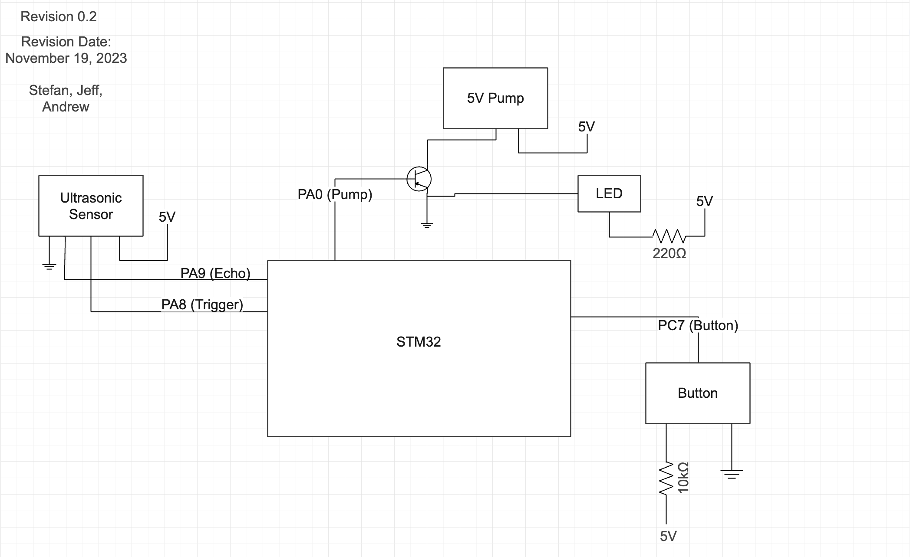

# Electrical Schematic - Rev 2

## Revisions from Rev 1
- Onboard LED connected to GPIO of Pump to act as a debugger as well as a real-time status indicator of the pump
- Transistor added to control the ground being connected to the pump, as well as the LED.
- Schematic created using electrical diagram software (edrawmax).