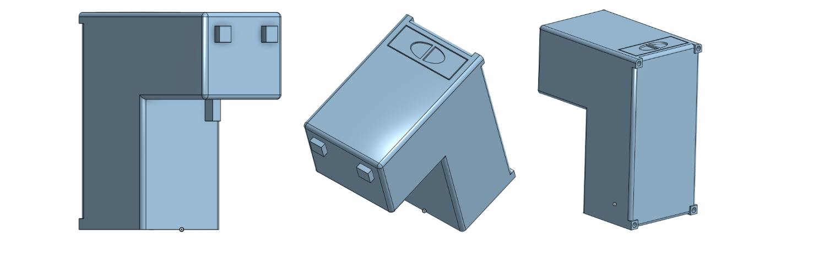

# Medicine Dispenser

Stefan, Andrew, Jeff


## Overview

This repository contains the source code and documentation for a Medicine Dispenser based on the STM32 microcontroller. The project aims to provide a convenient and automated solution for dispensing medicines at scheduled times.

## Features

- **Automated Dispensing:** The system is designed to automatically dispense medicines at specified intervals.
- **User Interface:** A user-friendly interface allows users to set dispensing schedules and monitor the status of the dispenser.
- **STM32 Microcontroller:** The project utilizes the power and flexibility of the STM32 microcontroller for precise control and reliability.

## Hardware Requirements

- STM32 Microcontroller (e.g., STM32F4 Discovery)
- Motor Driver
- Pump
- Keypad/Button Interface

## Software Requirements

- STM32CubeIDE
- STM32CubeMX
- CMSIS and HAL Libraries

## Getting Started

### 1. **Setup the STM32CubeIDE:**
   Download and install [STM32CubeIDE](https://www.st.com/en/development-tools/stm32cubeide.html).
   Open STM32CubeIDE and import the project:
   `File > Import > General > Existing Projects into Workspace`.
   Select the cloned repository as the root directory.

### 2. **Configure STM32CubeMX**
   Download and install [STM32CubeMX](https://www.st.com/en/development-tools/stm32cubemx.html).
   
### 3. **Clone the Repository:**
   ```bash
git clone https://github.com/yourusername/medicine-dispenser-stm32.git
   cd medicine-dispenser-stm32
```
   
### 4. **Install CMSIS and HAL Libraries**
   Download the necessary CMSIS and HAL libraries from the [STMicroelectronics website](https://www.st.com/).
   Extract the libraries and place them in the appropriate directories within the project.

### 5. **Build and Flash the Project**
   Build the project in STM32CubeIDE.
   Flash the compiled code onto the STM32 microcontroller.

## Gallery




